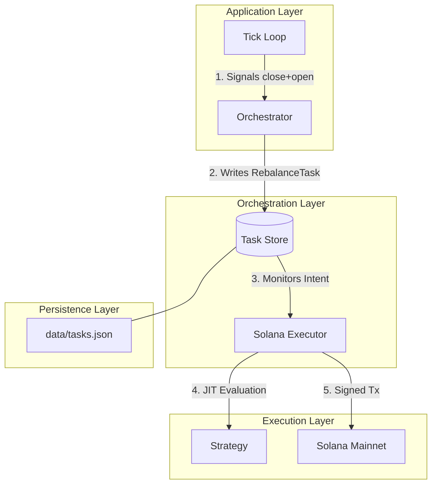
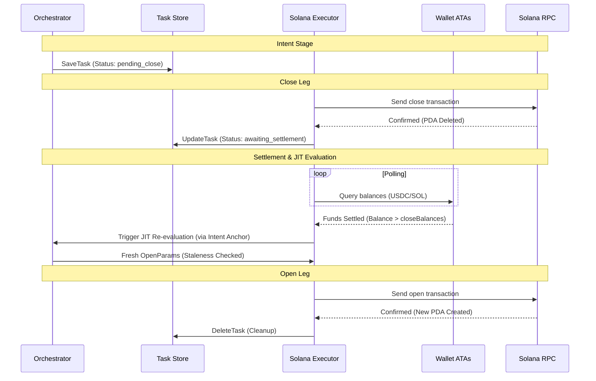
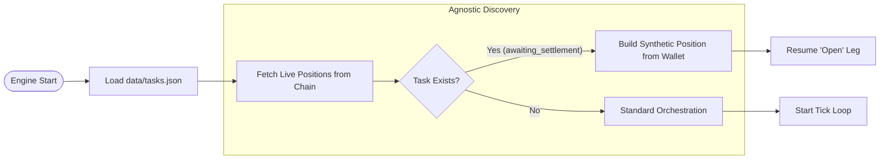

# Aria Vega Market Maker: Stateful Rebalance & Intent Architecture

This document defines the **Task-Intent (Write-Ahead Intent)** architecture designed to ensure atomic integrity during position rebalancing. This architecture prevents "Ghost Position" errors and manages signal decay during network congestion.

---

## 1. The Core Problem: Partial Execution

In a high-frequency CLMM environment, a rebalance consists of two distinct on-chain events: **Closing** an old position and **Opening** a new one.

- **State Blindness**: If the system relies solely on the blockchain for state, it "forgets" its intent the moment the `close` transaction succeeds because the position PDA is deleted.
- **Signal Decay**: RPC delays (e.g., HTTP 429) can stall execution, making the original strategy decision stale by the time the system is ready to open the second leg.

---

## 2. High-Level Domain Architecture

The system is organized into a vertical hierarchy where the **Task Store** acts as the persistent "glue" between strategy logic and on-chain execution.

Show Mermaid Source

---

## 3. Architectural Pillar: The Rebalance Task Store

To resolve state blindness, the system moves from a "Reactive" model to an **Intent-First** model.

### A. Data Model: `RebalanceTask`

A persistent record stored in `data/tasks.json` that tracks the lifecycle of a rebalance.

| Field                | Type       | Description                                                       |
| :------------------- | :--------- | :---------------------------------------------------------------- |
| `id`                 | `string`   | Unique UUID for the rebalance operation.                          |
| `assignmentId`       | `string`   | Link to the strategy configuration.                               |
| `status`             | `string`   | `pending_close` → `awaiting_settlement` → `pending_open`.         |
| `originalPositionId` | `string`   | The ID of the position being closed.                              |
| `intent`             | `Decision` | The full `Decision` object, including range and metadata.         |
| `evaluatedAt`        | `number`   | Timestamp of the strategy evaluation for JIT staleness checks.    |
| `closeBalances`      | `object`   | Snapshot of token balances at the moment of `close` confirmation. |

> [!IMPORTANT]
> **Data Integrity and Schema Validation**
> All persistence files must be loaded with strict schema validation (e.g., Zod). A corrupted `tasks.json` is a worst-case failure mode, and structural validation ensures the state machine never operates on partial or malformed data. Additionally, persistence uses per-file mutexes to prevent high-frequency logging from blocking time-sensitive task writes.

### B. Stateful Rebalance Flow (Atomic Integrity)

This flow ensures that if the system crashes after closing a position, it knows exactly how to resume the "open" leg using the tokens now sitting in the wallet.

Show Mermaid Source

### C. The Write-Ahead Workflow

1. **Intent Phase**: Before any transaction is signed, the `Tick Loop` writes a `RebalanceTask` to the `Task Store`. The orchestrator's `isExecuting` flag MUST be set to `true` atomically with the task write.
2. **Execution Phase**: The `SolanaExecutor` processes the task. Upon confirming the `close` transaction, it snapshots the current wallet balances into the task, and updates the task status to `awaiting_settlement`.
3. **Recovery Phase**: If the bot restarts, the `Discovery Loop` reads the `Task Store`. If a task is `awaiting_settlement`, it forcibly sets `isExecuting = true` on the newly registered orchestrator, skips the search for the missing position, and resumes the `open` leg.

---

## 4. Recovery Flow (Agnostic Discovery)

Upon startup, the engine synchronizes live blockchain data with local persistent intents to ensure no capital is left stranded in the wallet.

Show Mermaid Source

---

## 5. Just-In-Time (JIT) Re-Evaluation

To mitigate signal decay, the system enforces a **Staleness Check** before the final `open` transaction.

- **TTL Validation**: The executor compares `Date.now() - task.evaluatedAt` against a configurable `MAX_SIGNAL_AGE_MS` threshold.
- **JIT Trigger**: If the signal is stale, the executor transitions the task back to `awaiting_settlement` to trigger a re-tick and get fresh boundaries/rates.
- **Intent Anchoring**: Re-evaluation must only consider the original intent encoded in `task.intent`. It must not rebuild a new range from a stale snapshot, ensuring signal integrity.
- **Stateless Execution**: The JIT re-evaluation callback is passed explicitly rather than held as a closure, preventing execution against a deregistered orchestrator.

---

## 6. The Synthetic Position Factory

When a position is closed, the system cannot fetch its state from the chain. The **Synthetic Position Factory** bridges this gap during the `awaiting_settlement` phase.

1. **Position-Attributable Polling**: The bot queries the wallet's Associated Token Accounts (ATAs) to verify funds have settled by comparing current balances against the `closeBalances` snapshot. This ensures safe multi-position concurrent operation by tracking attributable deltas rather than total wallet balances.
2. **Synthesis**: It builds a `Position` object in memory using the settled tokens attributable to the task.
3. **Injection**: This synthetic object is passed to the strategy, allowing the calculator step to roll over the exact tokens recovered from the close.

---

## 7. Key Engineering Guardrails

- **Execution Lock**: The `Orchestrator` uses a public `isExecuting` flag to ignore new `Tick Loop` signals while a `RebalanceTask` is in progress. This flag must be set atomically with task persistence.
- **Write-Ahead Intent**: The `RebalanceTask` is written to disk _before_ the first transaction is signed, ensuring crash-recovery is possible.
- **Signal TTL**: Decisions are timestamped with `evaluatedAt`. If the delay exceeds `MAX_SIGNAL_AGE_MS` (configurable), the Executor forces a re-evaluation to account for price drift.
- **Fail-Safe**: If a `RebalanceTask` remains stuck, a fail-safe tracks the number of phase transitions (rather than just wall-clock time). If transitions stall, it triggers an emergency error alert and flags the task for operator review.
- **Dynamic Rent Calculation**: Rent costs for position account creation are calculated dynamically on-chain (`lamports_per_byte_year × account_size × minimum_balance_multiplier`), avoiding hardcoded buffers that can break upon protocol upgrades.
- **Circuit Breakers**:
  - **Meteora API**: Enforces a maximum snapshot age to prevent the Tick Loop from evaluating positions against stale market snapshots.
  - **RPC Circuit Breaker**: Halts new task generation and pauses in-flight tasks if the RPC error rate exceeds configured thresholds within a specific time window.
