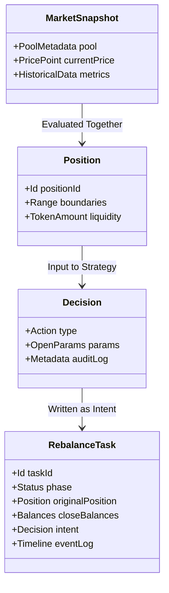
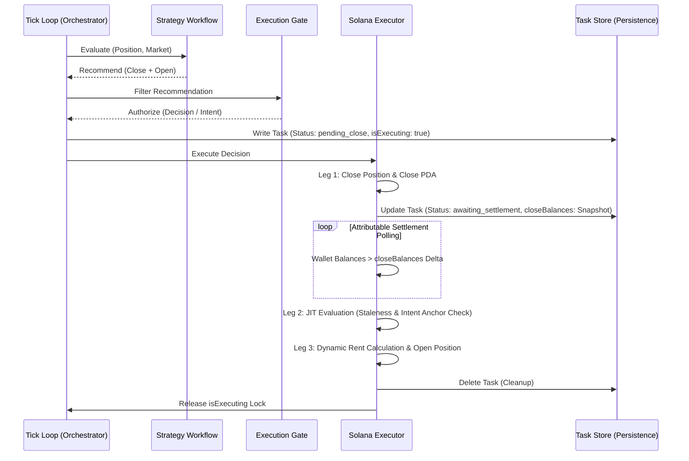

# Core Domain Models and Structural Contracts

This document establishes the conceptual domain models, state machines, and interface contracts that govern the LP strategy system. Instead of hardcoding transient TypeScript types, it describes the **high-level business rules, responsibilities, and structural boundaries** between modules.

---

## 1. Domain Entities and Conceptual Models

The system is organized around distinct conceptual domain entities that represent market state, investment positions, and planned operational intent.

### A. Asset and Liquidity Models

- **Token Quantities & Decimals**: Every asset holds precise, decimal-adjusted balance and precision metadata, ensuring that on-chain calculations are mapped cleanly to user-friendly values.
- **CLMM Bounds and Ranges**: Position configurations are described using price ratios, tick indices, and pool-specific constraints.
- **Position State**: The absolute on-chain state of liquidity accounts, active ranges, and ownership associations.

### B. Strategy Recommendations and Decisions

- **Recommendations**: Structural proposals generated by strategies (e.g., maintaining position, widening range, closing). They contain the raw calculated boundaries and funding allocations.
- **Decisions**: Evaluated, authorized, and gated recommendations ready to be serialized and dispatched as execution intents.

### C. The Rebalance Task (Write-Ahead Intent Schema)

The `RebalanceTask` is the ultimate persistent anchor that guarantees system integrity across crashes. It tracks:

- **Unique Identification**: Mapping the operational lifecycle to a unique workspace assignment.
- **Task Phase**: The progression from `pending_close` to `awaiting_settlement` and finally `pending_open`.
- **Identity Retention**: Holding the unique ID of the closed position to bridge state blindness.
- **Attributable Balance Snapshots**: Capturing exact token balances immediately following the `close` confirmation. This prevents collision during multi-position settlement tracking.
- **Intent Anchoring**: Storing the precise boundaries and allocations of the target position to prevent signal drift.
- **Audit Trails**: A sequence of timestamped event stages (`INIT`, `CLOSE_BROADCAST`, `SETTLEMENT_POLLING`, `JIT_REEVALUATION`, `OPEN_CONFIRMED`, etc.) for real-time observation.

---

## 2. Core Architectural Contracts: Roles and Responsibilities

Each subsystem in the monorepo corresponds to a specific architectural role defined by a strict boundary contract.

### A. Stateless Pipeline Components

- **`IStep` (Execution Pipeline Step)**:
  - _Role_: Executes a single, stateless unit of calculation or data enrichment within a workflow (e.g., computing range width or determining coin distribution).
  - _Responsibility_: Receives execution context and outputs an enriched or modified context. It possesses zero side-effects and zero in-memory persistence.
- **`IStrategy` (Trading Strategy)**:
  - _Role_: Translates market conditions and active positions into actionable trading recommendations.
  - _Responsibility_: Runs a composable sequence of `IStep` elements. It is purely deterministic and does not make on-chain calls or mutate files directly.

### B. Stateful Coordination and Safety Gates

- **`IOrchestrator` (Position Runtime Coordinator)**:
  - _Role_: Manages the active tick evaluation loop for a specific position.
  - _Responsibility_: Coordinates data collection, evaluates strategy recommendations, and triggers rebalances when thresholds are breached. It owns the `isExecuting` lock to prevent overlapping ticks during in-flight operations.
- **`IExecutionGate` (Safety Filter)**:
  - _Role_: Filters and inspects recommendations before allowing them to mutate system state.
  - _Responsibility_: Enforces volatility limits, gas fee constraints, and absolute risk caps. It acts as the final gatekeeper that converts raw recommendations into signed `Decisions`.

### C. Transaction Dispatch and Infrastructure Adapters

- **`IExecutor` (Lifecycle & Transaction Manager)**:
  - _Role_: Handles the sequential execution of gated decisions, dynamic rent checks, and in-flight recoveries.
  - _Responsibility_: Manages the complex multi-leg `close+open` lifecycle. It conducts JIT staleness assessments, polls token accounts for settlement based on the `closeBalances` snapshot, and orchestrates on-chain confirmations.
- **Providers (IO Interfaces)**:
  - _Role_: Abstracts the specific details of external APIs, Solana RPC clients, and rate-limiting load balancers.
  - _Responsibility_: Queries blockchain data, returns formatted pool shapes, and manages transaction broadcasting.
- **Stores (Persistence Interfaces)**:
  - _Role_: Provides clean read/write boundaries for persistent task states, local caches, and execution audit trails.
  - _Responsibility_: Saves and deletes configurations, tasks, and historical logs, utilizing per-file mutex locks to ensure thread-safe concurrency.

---

## 3. The Integration Pipeline

Below is the conceptual sequence showing how these contracts interact to execute a secure, atomic rebalance:

