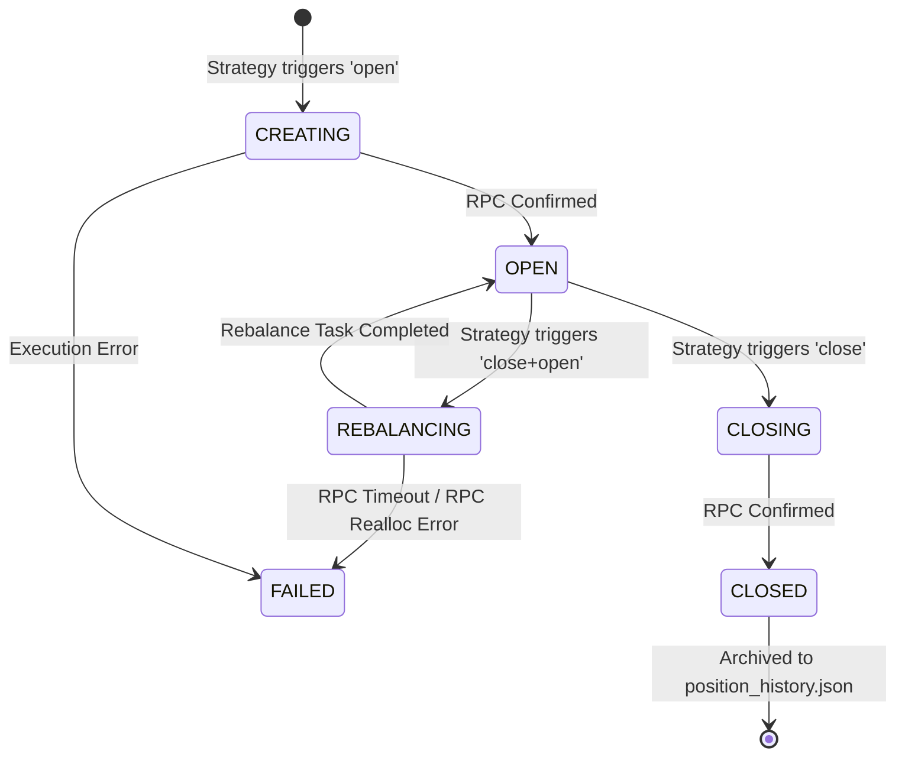

# Architecture Decision Record: Position Lifecycle State Machine

## Context and Problem Statement

Initially, the market-maker engine operated with a binary model for tracking liquidity positions: a position was either active (and cached in `known_positions.json`) or completely deleted. This introduced major gaps:

1. **Lack of Terminal States**: Positions that were closed on-chain or failed to rebalance disappeared entirely, meaning historical accounting, performance monitoring, and audit trails were non-existent.
2. **In-Flight State Uncertainty**: During active multi-step operations (such as the `close+open` rebalance sequence), the engine had to lock operations purely in-memory via `isExecuting`. If the engine rebooted mid-transaction, there was no persistent record of which positions were actively closing, rebalancing, or opening.

To solve this, we introduce an explicit, stateful, and audited **Position Lifecycle State Machine** synchronized with task execution states.

---

## Decision

We establish a strict state machine to govern positions:

1. **State Space Definition**:
   - `CREATING`: Initial setup broadcasted, awaiting RPC confirm.
   - `OPEN`: Verified active and healthy on-chain.
   - `REBALANCING`: Position is being exited in order to redeploy liquidity at balanced ranges.
   - `CLOSING`: Exit transaction is currently broadcasted, awaiting confirmation.
   - `CLOSED`: Position successfully closed on-chain (Terminal).
   - `FAILED`: Execution fatally failed during close or open legs (Terminal).

2. **Persistence & Pruning Separation**:
   - **`known_positions.json`** only holds active, working positions (`OPEN`, `CREATING`, `REBALANCING`, `CLOSING`).
   - **`position_history.json`** is a stateful append-only historical log for all terminal positions (`CLOSED`, `FAILED`), which stores timestamps and tracking parameters. Both files are serialized safely under `fileMutex`.

3. **Control Plane Exposure**:
   - `GET /positions` serves live/active positions from the cache.
   - `GET /positions/history` lists archived terminal positions.

---

## Consequences

- **Reliability & Crash Recovery**: Rebalancing positions remain in local cache storage across engine restarts, preventing in-flight positions from disappearing or becoming "ghosts".
- **Advanced Observability**: The Next.js React frontend displays explicit lifecycle states (e.g., pulsing yellow badges for `REBALANCING`), giving operators real-time visual tracking of active operations.
- **Audit Compliance**: Historical trades and closed/failed positions are preserved forever in a structured JSON ledger.
